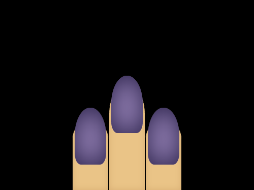

# Cloaked Spirits

  

## Bonus Target - Nail Paint

  

The colors used are:

 --sunset: #f1c27d

 --earth-yellow: #e0ac69

 --russian-violet: #231942

 --african-violet: #9f86c0

 --black: #000000
