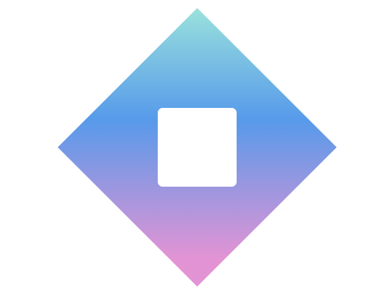

# Tesseract

  

## Bonus Target - Gradient Diamond

  

Mimicking a shape from [coolshap.es](https://coolshap.es/).

The colors used are:

 --tiffany-blue: #82e4dd

 --united-nations-blue: #3b9cf1

 --plum-web: #f08fd8