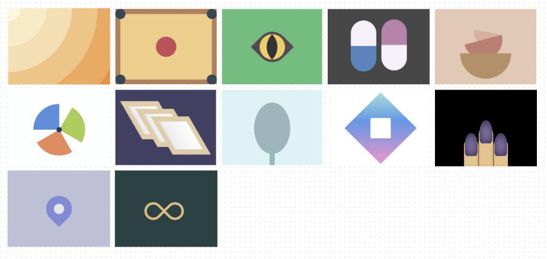

# CSS Battle Solutions + Bonus Targets
After a long journey of working with CSS frameworks, I have decided to come back to the roots. 
Even though I have worked in front-end for a while now, there are numerous CSS properties that I don't know of or haven't used to its full potential.

Nothing beats reading through https://developer.mozilla.org/en-US/docs/Web/CSS, and to practice CSS, one of the best resources you can find out there is https://cssbattle.dev/.

You can find my solution to each target here. Furthermore, to challenge myself further, **I decided to add a bonus target to each one**.(I must admit that this was also an attempt to boost my "hidden" creativity). 

  
   <em>Preview of my bonus targets for battle 1</em>

Feel free to attempt these side quest targets and put up your solutions. I will not minify the solutions to these so that it is readable.

 **Disclaimer:**
- I am making up these bonus targets as I go, so any exact resemblance to future targets on CSS Battle is purely coincidental.
- The bonus targets are ones I created for personal CSS Battle practice, not an official CSS Battle example.
- I am fully aware that there are numerous better ways of attempting these questions. Its still a work in progress, so I am welcome to any suggestions to better my solution. 

## Practicing with CSS Battle
 CSS Battle is a platform where developers compete to recreate target images using HTML and CSS. 
 
 The scores here are calculated based on the number of characters. So if you want to achieve high scores, you end up with pretty unreadable code. If you are just starting out I would recommend that you don't pay much attention to the scores but rather focus on achieving the solution.
 
 There are multiple great solutions out there that you can refer to, to see how you can do it in alternative ways.
 You can also read through https://cssbattle.dev/tips for some tips, on how to achieve lower character counts for better scores on the platform.

## Resources

CSS minifier - https://www.minifier.org/

Color palettes - https://coolors.co

Color gradients = https://cssgradient.io/

Cool Shapes to practice with - https://coolshap.es/

